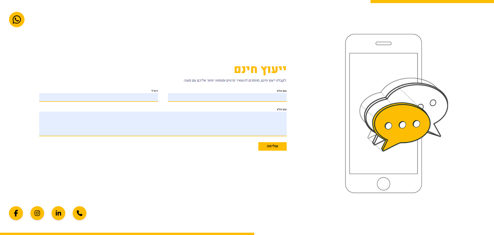

# Free Advisement

A pixel-perfect HTML & CSS implementation of a professional advisement/consulting landing page Figma UI design, styled with SASS.



---

## Table of Contents

- [Overview](#overview)
- [Demo](#demo)
- [Tech Stack](#tech-stack)
- [Project Structure](#project-structure)
- [Getting Started](#getting-started)
- [Design Reference](#design-reference)
- [Responsive Design](#responsive-design)
- [License](#license)

---

## Overview

This project is a UI implementation exercise built from a Figma design. It demonstrates a clean consulting/advisement landing page including a hero section, contact options with social media icons, and a mobile-first layout approach. Styles are written in SASS and compiled to CSS.

---

## Demo

Open `index.html` directly in your browser — no build step or server required.

> **Note:** To modify styles, edit the SASS source files and recompile to CSS.

---

## Tech Stack

| Technology | Purpose |
|---|---|
| HTML5 | Semantic page structure |
| CSS3 | Compiled output styles |
| SASS | CSS preprocessing and organization |

---

## Project Structure

```
free-advisement/
├── index.html              # Main HTML file
├── free_advisement.css     # Compiled CSS (do not edit directly)
└── images/                 # Icons and images
    ├── project_preview.png
    ├── mobile-text-convo.png
    ├── 2x_mobile-text-convo.png
    ├── phone.svg
    ├── facebook_f.svg
    ├── instagram.svg
    ├── linked-in.svg
    └── Icon awesome-whatsapp.svg
```

---

## Getting Started

### View the Project

1. Clone or download the repository.
2. Open `index.html` in any modern browser.

### Edit Styles

If you want to modify the styles, you will need SASS installed:

```bash
npm install -g sass
```

Then watch for changes:

```bash
sass --watch styles/main.scss free_advisement.css
```

---

## Design Reference

This project was implemented based on a Figma design. Key design elements include:

- Hero section with a prominent call-to-action
- Social media contact icons (LinkedIn, WhatsApp, Facebook, Instagram, Phone)
- Retina-ready images (`2x` variants included)
- Clean typographic hierarchy

---

## Responsive Design

The layout is responsive and adapts gracefully to mobile and desktop viewports using SASS-managed media queries and flexible units.

---

## License

This project is intended for educational and portfolio purposes.
